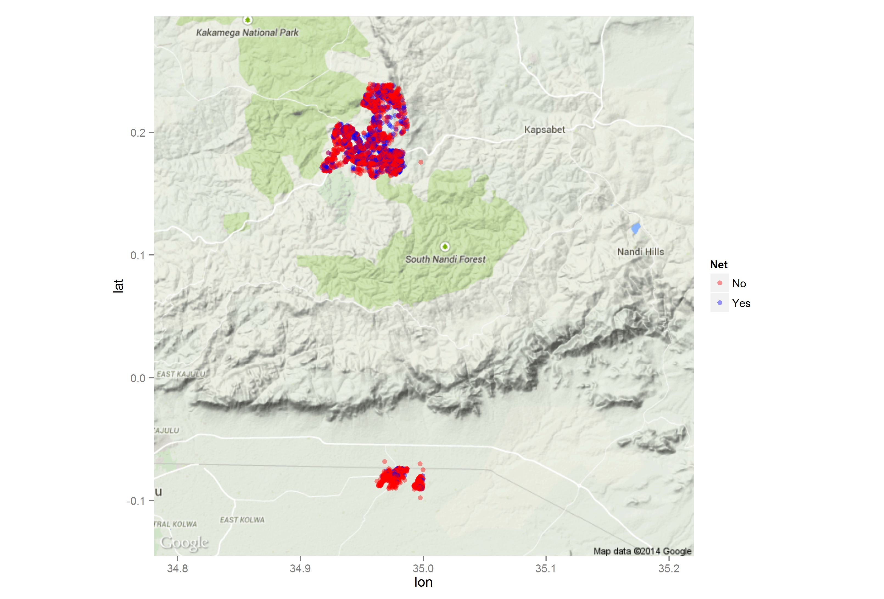
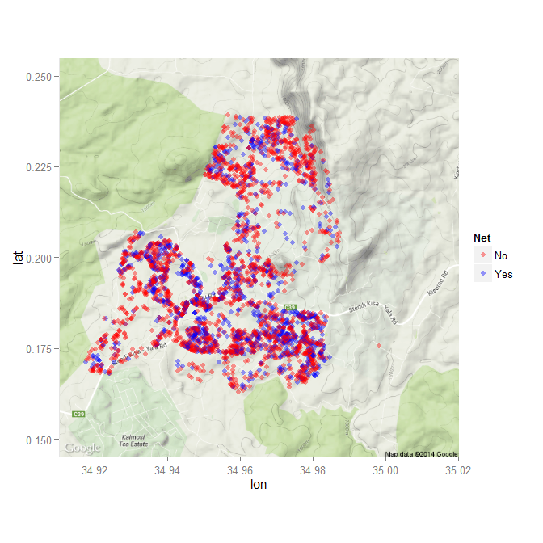
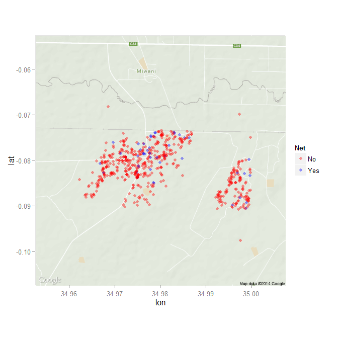
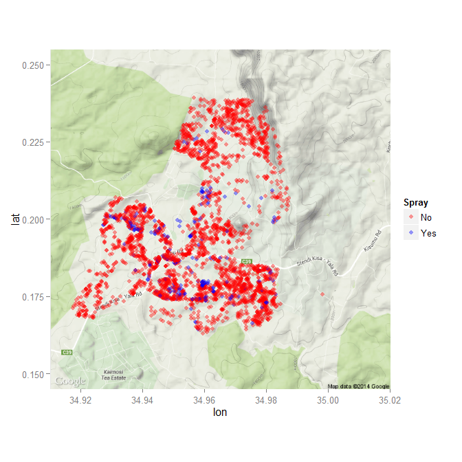
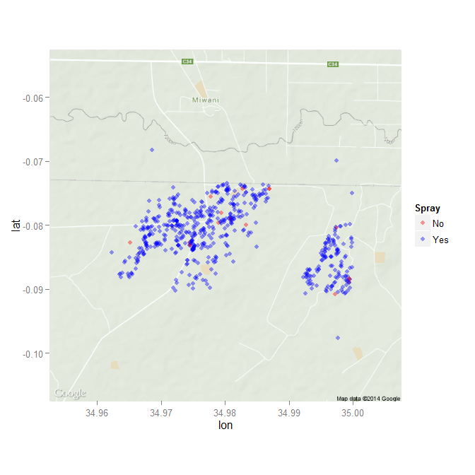

__Project:__ Are people at high risk for for poor outcomes from malaria infection being targeted for prophylactic measures in Kenya?

__PI:__ Dr. Kacey Ernst

__Statistician__ Dominic D. LaRoche

__Version:__ 1


```{r ReadIn,echo=FALSE,message=FALSE,warning=FALSE}
#read in and check data 
rm(list=ls())
library(car)
library(ggplot2)
library(ggmap)
library(MASS)
longdat<-read.csv("C:/Classes/AppliedBiostat/Project/Domconv_918.csv")[1:17823,]
longdat$site<-recode(longdat$site,"c('High','HIGH')='High'")
longdat$Villcodef<-as.factor(longdat$Villcode)
longdat$Housef<-as.factor(longdat$House)
#create a variable which combines subcode, villcode, and house
longdat$household<-factor(with(longdat, paste(Subcode, Villcode, House, sep="_")))
longdat$latlon<-factor(with(longdat, paste(Lat, Long, sep="_")))
# There are more unique housholds than latlons!
# strsplit(unique(dat$latlon),split="_") #get unique lat lons in a list
longdat$Age<-as.numeric(as.character(longdat$Age))#introducing NAs on purpose
longdat$HHhead<-Recode(longdat$HHhead,"c('F','M','N/A')='N'")
longdat$Relate<-as.numeric(as.character(Recode(longdat$Relate,"'N/A'=NA")))
longdat$HHspray<-Recode(longdat$HHspray,"c('','4','N/A')=NA")
longdat$NetHH<-Recode(longdat$NetHH,"'N/A'=NA")
longdat$NetHH<-droplevels(longdat$NetHH)
```

```{r eliminateDuplicates,echo=FALSE,eval=FALSE}
#find duplicates entries within households
houses<-factor(unique(longdat$household))
N<-length(houses)
#loop through households and find entires that have unique age sex combos
longdat$age_sex<-factor(paste(longdat$Age,longdat$Sex,sep="_"))
subdat<-list(length=N)
for( i in 1:N){
  #limit to 1 household
  housedat<-longdat[longdat$household==houses[i],]
  include<-which(!duplicated(housedat$age_sex))
  subdat[[i]]<-housedat[include,]
}
datunique<-do.call(rbind,subdat)
rm(subdat)
```

```{r summarizeHouseHolds, echo=FALSE, eval=FALSE}
#This chunk is to create a new data set which is based on the household 
numocc<-numFem<-numMale<-oldest<-youngest<-headsex<-headage<-net<-under5<-under1<-under18<-periph<-lat<-lon<-hspray<-site<-elev<-lang<-rep(0,length=N)
#loop through each unique household and calculate summary variables
for (i in 1:N){
  numocc[i]<-length(which(datunique$household==houses[i]))
  numFem[i]<-sum(datunique$household==houses[i] & datunique$Sex=="F",na.rm=T)
  numMale[i]<-sum(datunique$household==houses[i] & datunique$Sex=="M",na.rm=T)
  oldest[i]<-max(datunique[datunique$household==houses[i],]$Age)
  youngest[i]<-min(datunique[datunique$household==houses[i],]$Age)
  if(length(datunique[(datunique$household==houses[i] & datunique$HHhead=="Y"),]$Sex)==1){
    headsex[i]<-as.character(datunique[(datunique$household==houses[i] & datunique$HHhead=="Y"),]$Sex)
  }else{headsex[i]<-NA}
  if(length(datunique[datunique$household==houses[i]& datunique$HHhead=="Y",]$Age)==1){
    headage[i]<-datunique[datunique$household==houses[i]& datunique$HHhead=="Y",]$Age
  }else{headage[i]<-NA}
  netans<-as.character(datunique[datunique$household==houses[i],]$NetHH)
  net[i]<-sum(netans=="Y",na.rm=T)
  under5[i]<-sum(datunique[datunique$household==houses[i],]$Age<=5,na.rm=T)
  under1[i]<-sum(datunique[datunique$household==houses[i],]$Age<=1,na.rm=T)
  under18[i]<-sum(datunique[datunique$household==houses[i],]$Age<18,na.rm=T)
  family<-datunique[datunique$household==houses[i],]$Relate
  periph[i]<-any(family>9)#classify any one more distant than grandchild as periphery
  lat[i]<-datunique[datunique$household==houses[i],]$Lat[1]
  lon[i]<-datunique[datunique$household==houses[i],]$Long[1]
  spray<-datunique[datunique$household==houses[i],]$HHspray
  hspray[i]<-sum(spray=="Y",na.rm=T)
  site[i]<-datunique[datunique$household==houses[i],]$site[1]
  elev[i]<-datunique[datunique$household==houses[i],]$Elevation[1]
  lang[i]<-datunique[datunique$household==houses[i],]$Lang[1]
  
}
#create data frame from new data vectors
hdat<-data.frame(houses,numocc,numFem,numMale,oldest,youngest,headsex,headage,net,under5,under1,under18,periph,lat,lon,hspray,site,elev,lang)
#save new data to csv file so I don't have to run this costly loop again
write.csv(hdat,"C:/Classes/AppliedBiostat/Project/housedata.csv")
```

#Introduction

Mosquitoes are a problematic transmission vector for a number of infectious diseases in tropical and sub-tropical regions throughout the globe.  These diseases, such as malaria, can be particularly deadly for vulnerable populations with restricted access to healthcare.  Several promising methods for mitigating the risk of infection from mosquitoes have been deployed recently in high-risk regions.  The use of bed nets can reduce the number of encounters with mosquitoes and the diseases they harbor while  the use of aerial pesticides can reduce the local mosquito population. Both of these methods have been employed in Kenya in recent years but have been administered under different protocols.  

Both bed nets and aerial spraying take time and money to deploy.  Therefore, it is critical that treatments are first applied to populations at the highest risk of poor outcome from exposure to mosquitoes and only later applied to populations with low risk of poor outcome from exposure.  Some measures have been taken to ensure at-risk populations receive priority when administering treatment such as distributing bed nets to pregnant women.  However, it is unclear whether these measures are adequate in prioritizing mitigation for at-risk populations.  The purpose of this study is to determine whether individuals with the highest risk are more likely to receive a mitigating treatment.

#Data Description
##Household Data
The data are composed of 3,984 households at two sites in Kenya (fig. 1).  These two sites represent high elevation and low elevation populations.  Both sites have had partial treatment with both bed nets and aerial spraying.  The high site has more prevalent bed net usage whereas the low site has more prevalent aerial spraying (figs. 2-5).  Each occupant of the 3,984 households was interviewed about bed-net usage and household spraying for a total of 17,823 interviews.  Additional information for each participant was also collected such as age, sex, and relation to the head of the household.  Table 1 summarizes household information by bed net use and table 2 by spraying.


```{r importNewData,echo=FALSE,message=FALSE,results='asis'}
rm(list=ls())
library(BDSS)
hdat<-read.csv("C:/Classes/AppliedBiostat/Project/housedata.csv")
sumdat<-hdat
sumdat$net<-factor(ifelse(is.na(sumdat$net),NA,ifelse(sumdat$net==0,"No","Yes")))
sumdat$under5<-factor(ifelse(is.na(sumdat$under5),NA,ifelse(sumdat$under5==1,"Yes","No")))
sumdat$under1<-factor(ifelse(is.na(sumdat$under1),NA,ifelse(sumdat$under1==1,"Yes","No")))
sumdat$under18<-factor(ifelse(is.na(sumdat$under18),NA,ifelse(sumdat$under18==1,"Yes","No")))
sumdat$periph<-factor(ifelse(is.na(sumdat$periph),NA,ifelse(sumdat$periph==1,"Yes","No")))
sumdat$hspray<-factor(ifelse(is.na(sumdat$hspray),NA,ifelse(sumdat$hspray==0,"No","Yes")))
sumdat$site<-factor(ifelse(is.na(sumdat$site),NA,ifelse(sumdat$site==1,"High","Low")))
```

```{r HouseSummary,echo=FALSE,results='asis'}
SummaryTable(data=sumdat,rowvars=c("under5","under1","under18","periph","hspray","site","headsex"),row.names=c("Under 5","Under 1","Under 18","Peripheral Family","House Sprayed","Site","House Head Sex"),colvar="net",cont.vars=c("numocc","numFem","numMale","oldest","youngest","headage","elev"),output="rmarkdown")
```

Table 1. Summary of household attributes by houses with and without nets.


```{r HouseSummary2,echo=FALSE,results='asis'}
SummaryTable(data=sumdat,rowvars=c("under5","under1","under18","periph","net","site","headsex"),row.names=c("Under 5","Under 1","Under 18","Peripheral Family","Bed Net","Site","House Head Sex"),colvar="hspray",cont.vars=c("numocc","numFem","numMale","oldest","youngest","headage","elev"),output="rmarkdown")
```

Table 2. Summary of household attributes by houses with and without aerial spraying.


```{r HouseLoc,echo=FALSE,eval=TRUE,fig.cap="Household Locations",fig.height=7,fig.width=7,message=FALSE,warning=FALSE,eval=FALSE}
#plot the locations to see if there are any issues
#qplot(Long, Lat, data=dat)
restricted <- get_googlemap(center=c(35,.075), zoom = 11, maptype="terrain",file="C:/Classes/AppliedBiostat/Project/WholeArea")
whole_site<-ggmap(restricted)+geom_point(aes(x=lon, y=lat,color=net),data=sumdat,alpha=0.4)+scale_colour_manual("Net",values=c("red","blue"))
ggsave(filename="Whole_site.png",path="C:/Classes/AppliedBiostat/Project/figure",plot=whole_site)
```

Figure.1 Locations of households in study.  Blue dots represent households with nets.


```{r HighbyNet,echo=FALSE,eval=TRUE,fig.cap="Household Locations",fig.height=7,fig.width=7,message=FALSE,warning=FALSE,eval=FALSE}
high<- get_googlemap(center=c(34.965,.2), zoom = 13, maptype="terrain",filename="c:/Classes/AppliedBiostat/HighSite")
ggmap(high)+geom_point(aes(x=lon, y=lat,color=net),data=sumdat,alpha=0.4)+scale_colour_manual("Net",values=c("red","blue"))
```

Figure 2. Households with and without nets at the high site.


```{r LowbyNet,echo=FALSE,eval=TRUE,fig.cap="Household Locations",fig.height=7,fig.width=7,message=FALSE,warning=FALSE,eval=FALSE}
low<- get_googlemap(center=c(34.98,-.08), zoom = 14, maptype="terrain",filename="c:/Classes/AppliedBiostat/LowSite")
ggmap(low)+geom_point(aes(x=lon, y=lat,color=net),data=sumdat,alpha=0.4)+scale_colour_manual("Net",values=c("red","blue"))
```

 
Figure 3. Households with and without nets at the low site.

```{r HighbySpray,echo=FALSE,eval=TRUE,fig.cap="Household Locations",fig.height=7,fig.width=7,message=FALSE,warning=FALSE,eval=FALSE}
ggmap(high)+geom_point(aes(x=lon, y=lat,color=hspray),data=sumdat,alpha=0.4)+scale_colour_manual("Spray",values=c("red","blue"))
```

Figure 4. Households with and without spraying at the high site.


```{r LowbySpray,echo=FALSE,eval=TRUE,fig.cap="Household Locations",fig.height=7,fig.width=7,message=FALSE,warning=FALSE,eval=FALSE}

ggmap(low)+geom_point(aes(x=lon, y=lat,color=hspray),data=sumdat,alpha=0.4)+scale_colour_manual("Spray",values=c("red","blue"))
```

Figure 5. Households with and without spraying at the low site.

##Geo-Spatial Data
The Biodiversity Monitoring Transect Analysis in Africa network [(BIOTA)](http://www.biota-africa.de/East_GISWeb2_ba.php) has created a high resolution (10m) digital terrain model of the high elevation site in this study.  Lower resolution data (30m) is available for both the high and low site from the NASA Shuttle Radar Topography Mission [(SRTM)](http://www2.jpl.nasa.gov/srtm/cbanddataproducts.html).  The high resolution model was developed from topographic maps as part of BIOTA sub-project E02 but access to this data is currently in question.  

#Study Objectives

##Primary Objective

The primary objective of this research is to determine whether populations which are both at high combined risk for 1) a poor outcome from malaria,  and 2) encountering a mosquito hosting malaria, are receiving mitigating treatments at a higher rate than those with a low combined risk. Specifically we will test the following alternative hypotheses:

$H_0:$ High-risk households are not more likely to receive treatment than low-risk households.  
$H_a:$ High-risk households are more likely to receive treatment than low-risk households.

##Secondary Objectives

As a secondary objective, we will determine if populations which are only at risk either for a poor health outcome from a malaria infection, *or* for a mosquito encounter, are preferentially receiving mitigating treatments.  The secondary objective will allow us to determine if either risk is currently being addressed by existing protocols. By combining measures from the primary and secondary outcomes we will evaluate the potential benefit from modifying treatment administration protocols to incorporate more information on household risk in addition to the current strategy.  

#Study Variables and Covariates

The survey data are composed of 17,823 interviews at 3,984 households.  The unit of study for this analysis is the household.  Therefore, I will summarize the information from the surveys into household attributes.  Each household will vary with respect to both the risk of exposure to mosquitoes and the number of at risk individuals in the household. We will assign a health risk to each household by adding the number of children in the household under age 5 and the number of adults in the household over age 65.  

We will assign each household a risk for exposure to mosquitoes by deriving a continuous risk surface over the study area.  This risk will result from a Topographical Wetness Index (TWI) derived from the DEM data.  The TWI combines the total basin area (the area from which water will flow to a particular point) with the slope at that point to determine the amount of water likely to accumulate and provide breeding habitat for mosquitoes. We will create a continuous risk surface over the landscape by interpolating between points of high TWI.   

#Statistical Methods

Since the two sites have dramatically different rates of spraying and bed net usage we will analyze the high and low sites separately with regards to these outcomes.  We will also analyze the spraying and bed net usage separately within each site since these are known to be distributed to households under different protocols and are therefore likely to have different patterns.

##Primary Analysis

To be at risk for a poor outcome a person must 1) come in contact with a malaria hosting mosquito, and 2) be inherently vulnerable to malaria infection (i.e. very young or very old).  We will create two risk scores representing each of these household risks.  The household health risk will be equal to the number of individuals at high risk (i.e. under age 5 or over age 65).  The household exposure risk will be equal to the score of the risk surface at the house location.  Since these risks will be calculated on different scales we will center at 0 and standardize risk scores so that they are scale-independent.

We will add the standardized household health risk with the standardized household exposure risk to create a combined risk.  We will then determine if high risk households are more likely to have received either a bed-net or aerial spraying with a logistic model;

$$log(\frac{p}{1-p})=\beta_0 + \beta_1 \times \text{Combined Household Risk},$$

where p = Probability of a house having a treatment.  If $e^{\beta_1}$ is > 1 and statistically significant ($\alpha=0.05$) then high-risk households are more likely to receive treatment.  If $e^{\beta_1}$ is < 1 and statistically significant then high-risk households are less likely to receive treatment.  If $e^{\beta_1}$ is not statistically different from 1 then either there is no difference in spraying or bed net usage between high and low risk households or the test did not have enough power to detect a difference (see sensitivity analysis).

##Secondary Analyses

Existing protocols may be adequate at addressing household risk due to either inherent health risk or mosquito exposure risk, but not both.  We will conduct the same primary analysis but separate out these two risk scores as separate predictors:

$$log(\frac{p}{1-p})=\beta_0 + \beta_2 \times \text{Mosquito Exposure Risk} + \beta_3 \times \text{Health Risk},$$

where p = Probability of a house having a treatment.  The interpretation of $\beta_2$ and $\beta_3$ is the same as $\beta_1$ from the primary analysis, but specific to a risk type.

##Sensitivity Analyses

It is important to note that the result of a type II error from the test of $H_0$ using logistic regression could result in an unnecessary change in protocol because we fail to find a preferential administration of treatments to the high risk households when there really is one.  This failure to find a difference could be due solely to poor power in the test.  In the logistic regression the null hypothesis, $H_0$, is no difference in the administration of treatments.  Under this null the probability of finding a difference when there really is none is controlled at $\alpha=0.05$.  However, since protocols are in place to provide bed nets and spraying to at risk households, we feel it is also important to directly test whether high risk households are equally likely to receive a treatment as low-risk households. We will test this hypothesis by modifying the null and alternative hypotheses:

$H_0:$ High-risk households are more likely to receive treatment than low-risk households.  
$H_a:$ High-risk households are not more likely to receive treatment than low-risk households.

Therefore, it is appropriate to set the null hypothesis to test whether $\beta_1$ lies outside an "equivalence margin" (a difference which policy makers would consider trivial).  Unfortunately, it is unclear what size of equivalence margin would be considered appropriate by policy makers.  Therefore, we will test equivalence with 3 different margins: OR=0.95-1.05, 0.90-1.10, and 0.85-1.15.  We will use a two-one-sided test (TOST) procedure to test for equivalence by treating $\beta_1$ as the measured difference between high-risk and low-risk households.

#List of Tables and Figures

Table 1:  Parameter estimates and 95% confidence intervals from tests of primary objectives.  
Table 2:  Parameter estimates and 95% confidence intervals from tests of secondary objectives.  
Table 3:  Parameter estimates and 95% confidence intervals from sensitivity analyses.   
Figure 1: Map of high site showing risk level and treatment type for each household.   
Figure 2: Map of low site showing risk level and treatment type for each household.   

##Shells for Tables

Tables 1-3 will all follow the same format.

| Effect     |   N  | Estimate | 95% CI |
|:----------:|:----:|:--------:|:------:|
| High Net   | 3379 |          |        |
| High Spray | 3379 |          |        |
| Low Net    | 605  |          |        |
| Low Spray  | 605  |          |        |

-----------------------------------------

